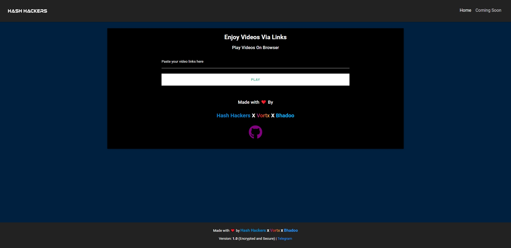
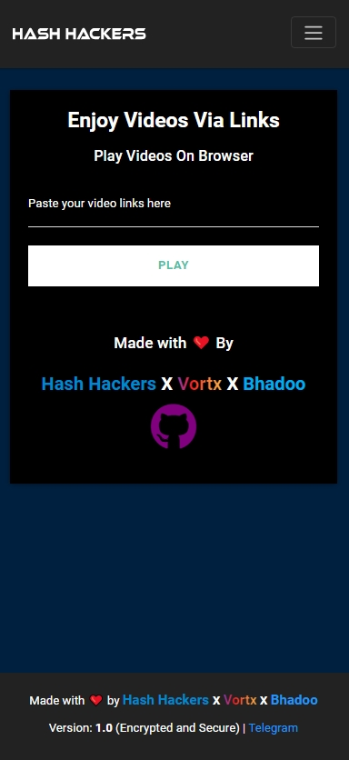
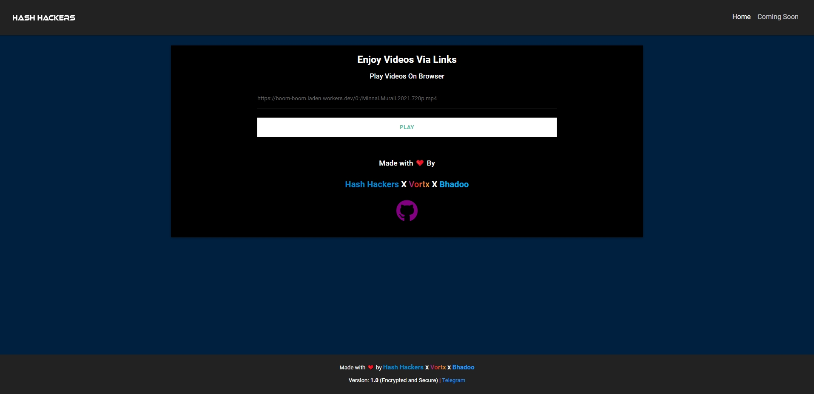
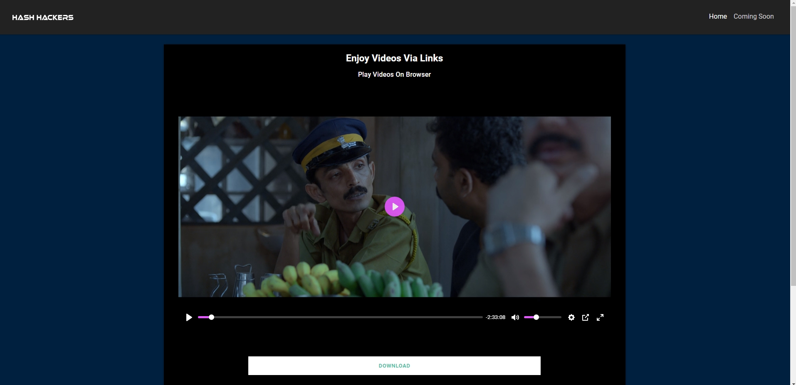

# **Index Player**
If you uses google drive index then its made for you. If you don't know about google drive index then don't forget to check the credits part.

- Code is pretty much clean now.
- Minor changes in the UI.
- Gonna come with new UI very soon.
- Fully responsive with toggle button.

# **Languages Used**
- HTML
- CSS
- Js
- Bootstrap
- Multiple CDN (Content Delivery Network) added by <a href="https://twitter.com/ParveenBhadoo"><b>Bhadoo</b></a> X <a href="https://telegram.dog/HashHackers"><b>Hash Hackers</b></a>

# **Work**
- If you have google drive index, then just copy the link of the video and paste it over here <a href="https://vortx-player.netlify.app" target="_blank"> <b>Index Player</b></a>. Enjoy your online streaming.

# **Screenshots**
In Desktop View:



In Mobile View:



# **How to Use It**
- First copy the link 
```
https://boom-boom.laden.workers.dev/0:/Minnal.Murali.2021.720p.mp4
``` 

- Click On <a href="https://vortx-player.netlify.app"><b>Index Player</b></a> and the page will look like this


- Then just paste the copied link.





- Click on Play & Enjoy :)....



# **Credit**
- <a href="https://gitlab.com/GoogleDriveIndex/Google-Drive-Index"> Google Drive Index </a>
- <a href="https://telegram.dog/HashHackers"> Hash Hackers</a>
- <a href="https://twitter.com/ParveenBhadoo"> Bhadoo </a>


# **Enjoy :)**
